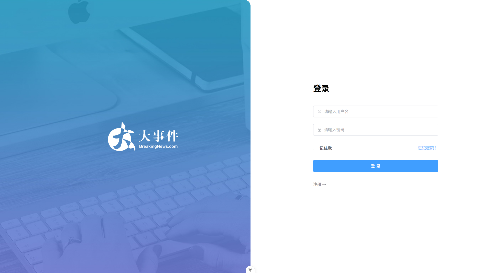
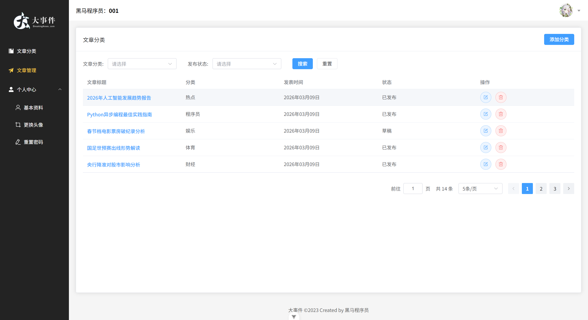
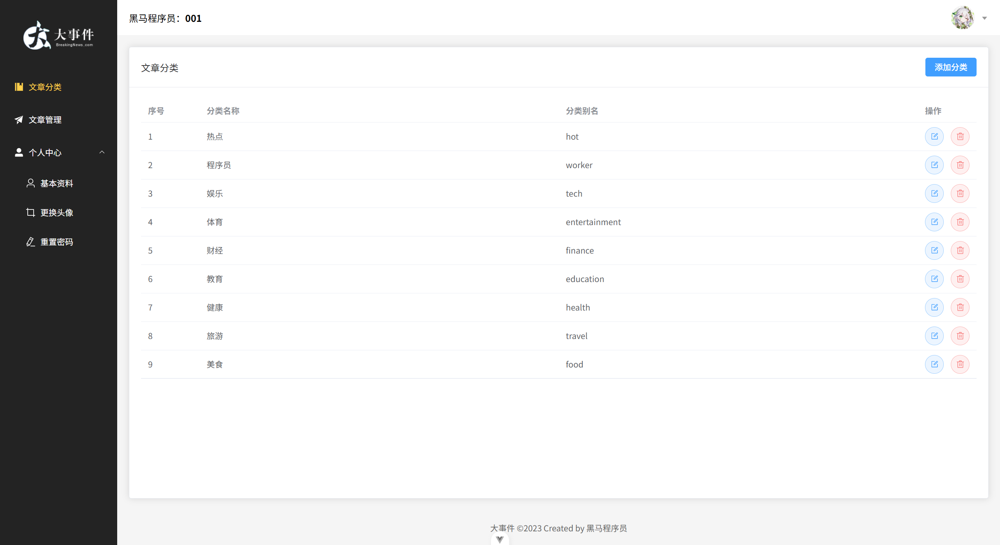

# 大事件管理系统项目案例分析

## 1. 项目概览与价值

### 项目名称：大事件管理系统

### 一句话价值：
一个基于Vue3的后台管理系统，集成文章管理与用户管理功能，实现对大事件数据的高效管理与直观展示。

### 开发角色：
独立开发者

### 核心技术与工具：
- **前端框架**：Vue 3.5.28
- **状态管理**：Pinia 3.0.4
- **UI组件库**：Element Plus 2.13.2
- **路由管理**：Vue Router 5.0.2
- **HTTP客户端**：Axios 1.13.5
- **构建工具**：Vite 7.3.1
- **代码规范**：ESLint、Prettier、Oxlint
- **版本控制**：Git
- **CSS预处理器**：Sass
- **富文本编辑器**：@vueup/vue-quill 1.2.0

## 2. 核心功能展示

### 关键页面截图：

#### 登录/注册页面


#### 文章管理页面


#### 文章分类管理页面


### 交互展示：
- **登录流程**：用户输入用户名密码 → 表单验证 → 登录成功 → 跳转到首页
- **文章管理**：支持文章的增删改查、状态筛选、分类筛选
- **分类管理**：支持分类的增删改查操作
- **用户管理**：支持个人资料修改、头像上传、密码修改

### 访问链接：
- **在线访问**：[待部署后添加]
- **GitHub仓库**：[待添加]

## 3. 项目深度解析

### 设计与开发思路

#### 技术栈选型理由：
- **Vue 3**：选择Vue 3的Composition API，提供了更灵活的代码组织方式，更好的TypeScript支持，以及更高效的响应式系统。
- **Pinia**：作为Vue 3的官方推荐状态管理库，相比Vuex，Pinia提供了更简洁的API，更好的TypeScript支持，以及更灵活的模块化设计。
- **Element Plus**：选择Element Plus作为UI组件库，提供了丰富的组件，良好的文档支持，以及与Vue 3的完美兼容。
- **Vite**：选择Vite作为构建工具，提供了更快的开发服务器启动速度，更高效的热更新，以及更小的生产构建体积。

#### 项目架构设计：
- **目录结构**：采用模块化设计，将代码按功能划分为api、assets、components、router、stores、utils、views等目录。
- **状态管理**：使用Pinia进行状态管理，将用户状态独立封装在user模块中，并支持持久化存储。
- **路由设计**：采用嵌套路由结构，将登录页面与主布局页面分离，主布局页面包含文章管理、分类管理、用户管理等子路由。
- **API封装**：将API请求封装在api目录下，统一处理请求和响应。

### 挑战与解决方案

#### 挑战1：用户认证与权限控制

**问题描述**：如何实现用户登录认证、token管理以及路由权限控制，确保只有登录用户才能访问受保护的路由。

**解决方案**：
1. **token管理**：使用Pinia管理用户token，并通过pinia-plugin-persistedstate插件实现token的本地存储。
2. **路由守卫**：在router.beforeEach中实现路由守卫，检查用户是否登录，未登录用户自动跳转到登录页面。
3. **API请求拦截**：在axios请求拦截器中添加token，确保API请求携带认证信息。

**代码实现**：
```javascript
// 路由守卫实现
router.beforeEach((to) => {
  const useStore = useUserStore()
  if (!useStore.token && to.path !== '/login') return '/login'
})

// Pinia状态管理实现
export const useUserStore = defineStore(
  'big-user',
  () => {
    const token = ref('')
    const setToken = (newToken) => {
      token.value = newToken
    }
    const removeToken = () => {
      token.value = ''
    }
    const user = ref()
    const getUser = async () => {
      const {
        data: { data }
      } = await userGetInfoService()
      user.value = data
    }
    const setUser = (newUser) => {
      user.value = newUser
    }
    return {
      token,
      setToken,
      removeToken,
      user,
      getUser,
      setUser
    }
  },
  {
    persist: true
  }
)
```

#### 挑战2：文章管理功能的实现

**问题描述**：如何实现文章的增删改查、分页、筛选等功能，确保用户体验流畅。

**解决方案**：
1. **组件化设计**：将文章编辑功能封装为独立的ArticleEdit组件，支持添加和编辑文章。
2. **分页实现**：使用Element Plus的el-pagination组件实现分页功能，支持页码和每页条数的调整。
3. **筛选功能**：实现文章分类和状态的筛选功能，通过参数传递给API请求。
4. **加载状态**：添加loading状态，提升用户体验。

**代码实现**：
```javascript
// 文章列表获取实现
const getArticleList = async () => {
  loading.value = true
  const res = await artGetListService(params.value)
  articleList.value = res.data.data
  total.value = res.data.total
  loading.value = false
}

// 分页和筛选实现
const onSizeChange = (size) => {
  params.value.pagenum = 1
  params.value.pagesize = size
  getArticleList()
}
const onCurrentChange = (page) => {
  params.value.pagenum = page
  getArticleList()
}
const onSearch = () => {
  params.value.pagenum = 1
  getArticleList()
}
```

### 性能与体验优化

#### 1. 路由懒加载
使用动态导入实现路由懒加载，减少初始加载时间：
```javascript
const router = createRouter({
  history: createWebHistory(import.meta.env.BASE_URL),
  routes: [
    { path: '/login', component: () => import('@/views/login/LoginPage.vue') },
    {
      path: '/',
      component: () => import('@/views/layout/LayoutContainer.vue'),
      redirect: '/article/manage',
      children: [
        { path: '/article/manage', component: () => import('@/views/article/ArticleManage.vue') },
        { path: '/article/channel', component: () => import('@/views/article/ArticleChannel.vue') },
        { path: '/user/profile', component: () => import('@/views/user/UserProfile.vue') },
        { path: '/user/avatar', component: () => import('@/views/user/UserAvatar.vue') },
        { path: '/user/password', component: () => import('@/views/user/UserPassword.vue') }
      ]
    }
  ]
})
```

#### 2. 组件性能优化
- 使用v-loading指令添加加载状态，提升用户体验
- 合理使用computed和watch，避免不必要的计算和渲染
- 组件拆分合理，提高代码复用性和可维护性

#### 3. 数据缓存策略
- 使用Pinia的持久化插件，缓存用户token，避免重复登录
- 合理设计API请求，减少不必要的网络请求

#### 4. 图片资源处理
- 使用合适尺寸的图片，减少加载时间
- 图片资源统一管理，便于维护

## 4. 代码与技能亮点

### 代码片段展示

#### 1. Pinia状态管理设计
```javascript
// src/stores/modules/user.js
import { defineStore } from 'pinia'
import { userGetInfoService } from '@/api/user'
import { ref } from 'vue'

export const useUserStore = defineStore(
  'big-user',
  () => {
    const token = ref('')
    const setToken = (newToken) => {
      token.value = newToken
    }
    const removeToken = () => {
      token.value = ''
    }
    const user = ref()
    const getUser = async () => {
      const {
        data: { data }
      } = await userGetInfoService()
      user.value = data
    }
    const setUser = (newUser) => {
      user.value = newUser
    }
    return {
      token,
      setToken,
      removeToken,
      user,
      getUser,
      setUser
    }
  },
  {
    persist: true
  }
)
```
**技术说明**：
- 使用Pinia的Composition API风格定义store
- 实现了token的管理和用户信息的获取
- 通过persist选项实现状态持久化，避免页面刷新后数据丢失

#### 2. 文章管理组件实现
```javascript
// src/views/article/ArticleManage.vue
<script setup>
import ChannelSelect from './components/ChannelSelect.vue'
import { Delete, Edit } from '@element-plus/icons-vue'
import { artGetListService, artDeleteService } from '@/api/article'
import { formatTime } from '@/utils/format'
import ArticleEdit from './components/ArticleEdit.vue'

import { ref } from 'vue'
import { ElMessageBox } from 'element-plus'

const articleList = ref([])
const total = ref(0)
const loading = ref(false)
const params = ref({
  pagenum: 1, // 当前页码数
  pagesize: 5, // 每页显示条数
  cate_id: '',
  state: ''
})

const getArticleList = async () => {
  loading.value = true
  const res = await artGetListService(params.value)
  articleList.value = res.data.data
  total.value = res.data.total
  loading.value = false
}
getArticleList()

// 分页和筛选方法...

const onDeleteArticle = async ({ id }) => {
  await ElMessageBox.confirm('确定删除该文章吗？', '温馨提示', {
    confirmButtonText: '确定',
    cancelButtonText: '取消',
    type: 'warning'
  })
  await artDeleteService(id)
  ElMessage.success('删除成功')
  getArticleList()
}
</script>
```
**技术说明**：
- 使用Vue 3的Composition API组织代码
- 实现了文章列表的获取、分页、筛选和删除功能
- 使用Element Plus的组件和对话框，提升用户体验
- 合理的错误处理和用户提示

### 技能提升总结

1. **框架特性应用**：
   - 掌握了Vue 3的Composition API，包括ref、computed、watch等核心功能
   - 熟悉了Pinia状态管理库的使用，包括store的定义、状态持久化等
   - 掌握了Vue Router的使用，包括路由配置、路由守卫等

2. **工程化实践**：
   - 熟悉了Vite构建工具的使用，包括项目初始化、开发服务器、生产构建等
   - 掌握了ESLint、Prettier等代码规范工具的配置和使用
   - 了解了Husky、lint-staged等Git钩子工具的使用，确保代码质量

3. **问题解决方法**：
   - 学会了如何实现用户认证和权限控制
   - 掌握了如何实现复杂的表单验证和数据处理
   - 学会了如何优化前端性能，提升用户体验

## 5. 总结与回顾

### 项目收获

1. **技术能力**：
   - 深化了对Vue 3生态系统的理解，包括Vue 3、Pinia、Vue Router等
   - 提高了前端工程化能力，包括项目配置、代码规范、构建优化等
   - 增强了问题解决能力，能够独立分析和解决开发过程中遇到的问题

2. **工程实践**：
   - 掌握了模块化、组件化的开发方式，提高了代码的可维护性和可复用性
   - 学会了如何设计合理的项目结构，便于团队协作和后续扩展
   - 了解了前端性能优化的各种方法，提升了应用的用户体验

3. **业务理解**：
   - 深入理解了后台管理系统的业务逻辑和用户需求
   - 学会了如何将业务需求转化为技术实现
   - 提高了产品思维，能够从用户角度思考问题

### 反思与改进

1. **架构优化**：
   - 可以进一步优化项目架构，如引入TypeScript，提高代码的类型安全性
   - 可以考虑使用更细粒度的组件拆分，提高代码的可维护性
   - 可以引入状态管理的模块化设计，更好地组织复杂的状态逻辑

2. **技术升级**：
   - 可以升级到最新的Vue 3版本，享受更多新特性
   - 可以考虑使用Vitest进行单元测试，提高代码质量
   - 可以引入CI/CD流程，自动化构建和部署过程

3. **用户体验提升**：
   - 可以优化页面加载速度，如使用图片懒加载、代码分割等技术
   - 可以增强响应式设计，确保在不同设备上的良好体验
   - 可以添加更多的动画效果，提升用户体验

4. **功能扩展**：
   - 可以添加数据可视化功能，如使用ECharts展示文章数据统计
   - 可以实现更多的用户权限控制，如基于角色的权限管理
   - 可以添加更多的交互功能，如拖拽排序、批量操作等

### 未来展望

大事件管理系统是一个功能完整的后台管理系统，通过本次开发，我不仅掌握了Vue 3生态系统的核心技术，还提高了前端工程化能力和问题解决能力。未来，我将继续优化和扩展这个项目，使其成为一个更加完善、高效、用户友好的后台管理系统。同时，我也将把在这个项目中积累的经验应用到其他项目中，不断提升自己的技术水平和工程素养。