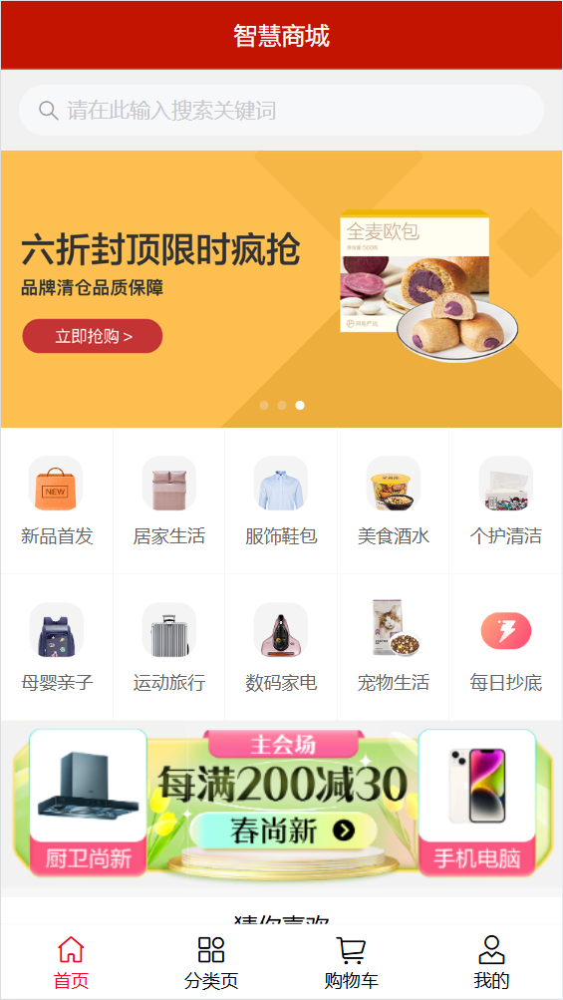
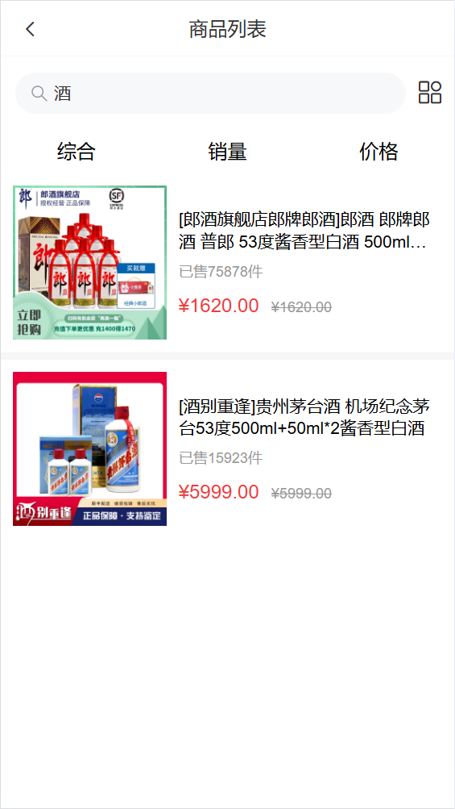
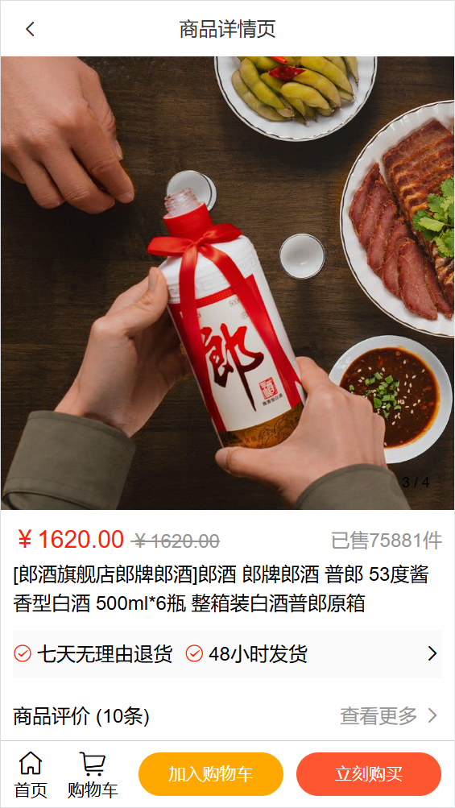
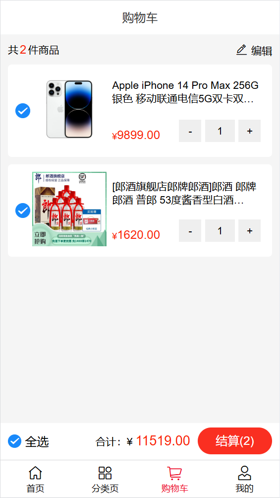
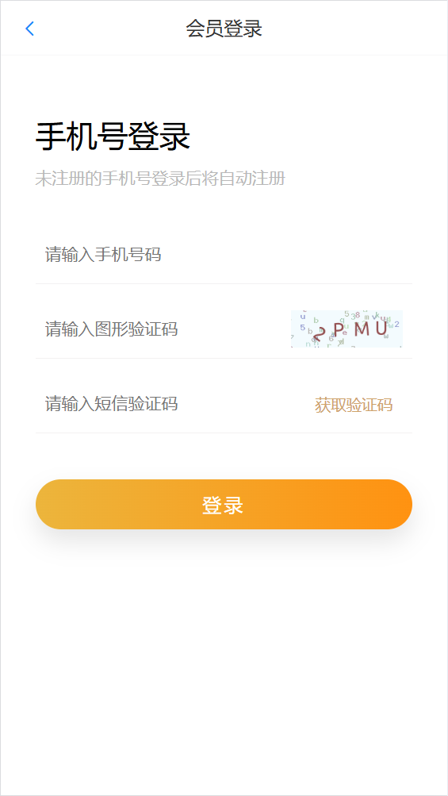
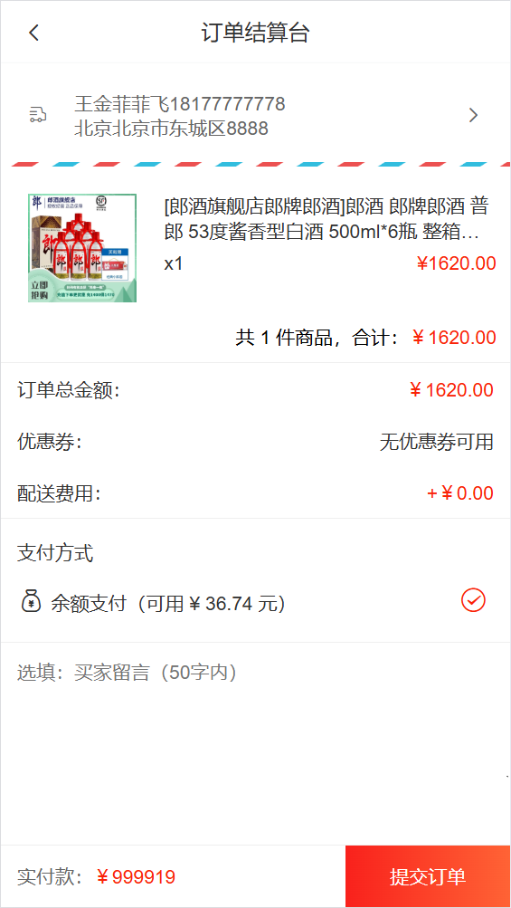
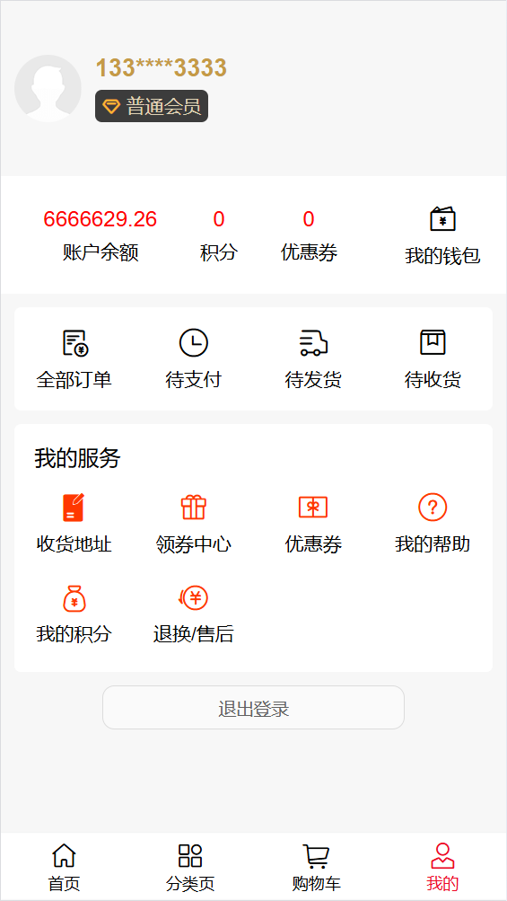

# 智慧商城项目案例研究文档

## 1. 项目概览与价值定位

### 核心目标
在10秒内让读者快速理解项目本质与核心价值。

### 关键内容
- **项目名称**：智慧商城
- **一句话价值定位**：一个基于Vue2的移动端电商全栈演示项目，实现了用户从浏览、购物到支付的完整流程。
- **开发角色说明**：独立开发的学习项目，个人独立完成度100%，技术实现深度覆盖前端全栈开发核心技能。
- **核心技术栈详述**：
  - 前端框架：Vue2
  - 状态管理：Vuex
  - 路由管理：Vue Router
  - 网络请求：Axios
  - UI组件库：Vant UI
  - 后台技术：使用第三方API接口（http://smart-shop.itheima.net）
  - 部署方案：支持本地开发环境与生产环境构建

## 2. 核心功能展示

### 关键页面可视化展示

#### 首页界面


#### 商品列表页


#### 商品详情页


#### 购物车功能


#### 用户登录/注册流程


#### 订单结算


#### 个人中心


### 交互展示
- **演示视频**：项目包含完整的交互演示视频（项目图片/演示视频.mp4）

### 可访问链接
- **项目在线访问地址**：（部署完成后添加）
- **GitHub仓库链接**：（添加仓库链接）

## 3. 项目深度解析

### 技术选型论证

#### 为何选择Vue2作为核心框架
- **成熟稳定**：Vue2经过多年发展，生态完善，文档丰富，社区活跃
- **渐进式框架**：易于学习和使用，适合快速开发
- **响应式数据绑定**：简化状态管理，提高开发效率
- **组件化开发**：促进代码复用，提升项目可维护性

#### 为何选择Vant UI作为组件库
- **移动端优化**：专为移动端设计，适配各种移动设备
- **轻量高效**：体积小，性能优，加载速度快
- **丰富组件**：提供完整的电商所需组件，如商品卡片、购物车、订单等
- **易于定制**：支持主题定制，满足项目个性化需求

#### 各技术间的协同优势
- **Vue2 + Vuex**：实现全局状态管理，解决跨组件数据共享问题
- **Vue2 + Vue Router**：实现单页应用路由管理，提供流畅的页面切换体验
- **Vue2 + Axios**：实现网络请求，与后端API交互
- **Vue2 + Vant UI**：快速构建美观的移动端界面

### 挑战与解决方案

#### 挑战一：登录状态管理

**问题背景与具体表现**：
- 用户登录后，刷新页面或关闭浏览器后需要保持登录状态
- 不同页面需要获取用户登录信息进行权限判断

**排查过程与思路分析**：
- 分析需求：需要实现登录状态的持久化存储
- 技术选型：使用localStorage存储用户信息
- 实现方案：在Vuex中管理用户状态，同时同步到localStorage

**解决方案的设计与实现**：
```javascript
// src/utils/storage.js
const INFO_KEY = 'hm-shopping'

// 获取个人信息
export const getInfo = () => {
  const result = localStorage.getItem(INFO_KEY)
  return result ? JSON.parse(result) : { token: '', userId: '' }
}
// 设置个人信息
export const setInfo = (obj) => {
  localStorage.setItem(INFO_KEY, JSON.stringify(obj))
}

// src/store/modules/user.js
import { getInfo, setInfo } from '@/utils/storage'
export default {
  namespaced: true,
  state () {
    return {
      userInfo: getInfo()
    }
  },
  mutations: {
    setUserInfo (state, obj) {
      state.userInfo = obj
      setInfo(obj)
    }
  },
  actions: {
    logout (context) {
      context.commit('setUserInfo', {})
      context.commit('cart/setCartList', [], { root: true })
    }
  }
}
```

**最终效果与经验总结**：
- 实现了登录状态的持久化存储
- 用户刷新页面或重新打开浏览器后保持登录状态
- 通过Vuex的getters获取token，方便在路由守卫中进行权限判断

#### 挑战二：购物车状态管理与同步

**问题背景与具体表现**：
- 购物车商品数量变更需要实时同步到后端
- 购物车商品选中状态需要在前端管理
- 购物车数据需要在页面刷新后保持

**排查过程与思路分析**：
- 分析需求：需要实现购物车数据的本地管理与后端同步
- 技术选型：使用Vuex管理购物车状态，通过API与后端同步
- 实现方案：在Vuex中维护购物车列表，包含商品数量、选中状态等信息

**解决方案的设计与实现**：
```javascript
// src/store/modules/cart.js
export default {
  namespaced: true,
  state () {
    return {
      cartList: []
    }
  },
  mutations: {
    setCartList (state, obj) {
      state.cartList = obj
    },
    toggleCheck (state, goodsId) {
      const goods = state.cartList.find(item => item.goods_id === goodsId)
      goods.isChecked = !goods.isChecked
    },
    toggleAllCheck (state, flag) {
      state.cartList.forEach(item => {
        item.isChecked = flag
      })
    },
    changeCount (state, { goodsId, goodsNum }) {
      const updateList = state.cartList.find(item => item.goods_id === goodsId)
      updateList.goods_num = goodsNum
    }
  },
  actions: {
    async getActionCart (context) {
      const { data: { list } } = await getCartList()
      list.forEach(item => {
        item.isChecked = true
      })
      context.commit('setCartList', list)
    },
    async updateActionCart (context, { goodsNum, goodsId, goodsSkuId }) {
      context.commit('changeCount', { goodsId, goodsNum })
      await changeCount(goodsId, goodsNum, goodsSkuId)
    },
    async delSel (context) {
      const selCartList = context.getters.selCartList
      const cartIds = selCartList.map(item => item.id)
      await delSel(cartIds)
      context.dispatch('getActionCart')
    }
  },
  getters: {
    isAllChecked (state) {
      return state.cartList.every(item => item.isChecked)
    },
    cartTotal (state) {
      return state.cartList.reduce((sum, item) => sum + item.goods_num, 0)
    },
    selCartList (state) {
      return state.cartList.filter(item => item.isChecked)
    },
    selCount (state, getters) {
      return getters.selCartList.reduce((sum, item) => sum + item.goods_num, 0)
    },
    selPrice (state, getters) {
      return getters.selCartList.reduce((sum, item) => sum + item.goods_num * item.goods.goods_price_min, 0).toFixed(2)
    }
  }
}
```

**最终效果与经验总结**：
- 实现了购物车商品的增删改查功能
- 实现了购物车商品的选中状态管理
- 实现了购物车数据与后端的实时同步
- 通过Vuex的getters计算购物车总价和数量，简化组件逻辑

### 性能与体验优化

#### 图片懒加载实现
- 使用Vant UI的Image组件，支持图片懒加载
- 减少初始加载时间，提升页面渲染速度

#### 路由懒加载策略
```javascript
// src/router/index.js
const Layout = () => import('@/views/layout')
const Login = () => import('@/views/login')
const Myorder = () => import('@/views/myorder')
const Pay = () => import('@/views/pay')
const Prodetail = () => import('@/views/prodetail')
const Search = () => import('@/views/search')
const SearchList = () => import('@/views/search/list')
```
- 实现路由组件的按需加载，减少初始包体积
- 提升首屏加载速度，优化用户体验

#### 代码分割与打包优化
- 使用Vue CLI的默认配置，自动进行代码分割
- 按需引入Vant UI组件，减少不必要的代码

#### 其他提升用户体验的技术手段
- **请求拦截器**：添加加载动画，提升用户体验
- **响应拦截器**：统一处理错误，提供友好的错误提示
- **路由守卫**：实现页面权限控制，保护用户数据安全

## 4. 代码与技能亮点

### 代码片段展示

#### 代码片段一：Axios请求拦截器实现
```javascript
// src/utils/request.js
import store from '@/store'
import axios from 'axios'
import { Toast } from 'vant'

const request = axios.create({
  baseURL: 'http://smart-shop.itheima.net/index.php?s=/api',
  timeout: 5000
})

// 添加请求拦截器
request.interceptors.request.use(function (config) {
  // 在发送请求之前做些什么
  Toast.loading({
    message: '加载中...',
    forbidClick: true,
    loadingType: 'spinner',
    duration: 0
  })
  const token = store.getters.token
  if (token) {
    config.headers['Access-Token'] = token
    config.headers.platform = 'H5'
  }
  return config
}, function (error) {
  // 对请求错误做些什么
  return Promise.reject(error)
})

// 添加响应拦截器
request.interceptors.response.use(function (response) {
  // 2xx 范围内的状态码都会触发该函数。
  // 对响应数据做点什么
  const result = response.data
  if (result.status !== 200) {
    Toast(result.message)
    return Promise.reject(result.message)
  }
  Toast.clear()
  return result
}, function (error) {
  // 超出 2xx 范围的状态码都会触发该函数。
  // 对响应错误做点什么
  return Promise.reject(error)
})

export default request
```

**功能说明与设计思路**：
- 创建axios实例，配置基础URL和超时时间
- 添加请求拦截器，在请求发送前添加token和平台信息，同时显示加载动画
- 添加响应拦截器，统一处理响应数据和错误

**技术亮点与创新点**：
- 统一的请求处理逻辑，减少重复代码
- 自动管理加载动画，提升用户体验
- 统一的错误处理，提供友好的错误提示

**应用场景与价值**：
- 适用于所有API请求，确保请求的一致性和可靠性
- 提升代码可维护性，降低后续开发成本

#### 代码片段二：Vuex模块化状态管理设计
```javascript
// src/store/index.js
import Vue from 'vue'
import Vuex from 'vuex'
import user from './modules/user'
import cart from './modules/cart'

Vue.use(Vuex)

export default new Vuex.Store({
  state: {
  },
  getters: {
    token (state) {
      return state.user.userInfo.token
    }
  },
  mutations: {
  },
  actions: {
  },
  modules: {
    user,
    cart
  }
})
```

**功能说明与设计思路**：
- 使用Vuex模块化管理状态，将用户状态和购物车状态分离
- 通过getters提供全局访问token的方法，方便路由守卫使用

**技术亮点与创新点**：
- 模块化设计，提高代码可维护性
- 命名空间隔离，避免状态冲突
- 统一的状态管理，简化组件间数据传递

**应用场景与价值**：
- 适用于复杂的状态管理场景，如用户信息、购物车数据等
- 提升代码可读性和可维护性

### 技能提升总结

#### 前端框架应用能力
- 熟练掌握Vue2框架的核心概念和使用方法
- 熟悉Vuex状态管理和Vue Router路由管理
- 掌握Axios网络请求的配置和使用

#### 工程化实践经验
- 熟悉Vue CLI项目的搭建和配置
- 掌握前端项目的目录结构设计
- 了解代码分割和打包优化的方法

#### 问题解决能力
- 具备分析和解决前端开发中常见问题的能力
- 能够独立排查和修复bug
- 具备优化前端性能的能力

#### 项目架构设计思路
- 理解前端项目的架构设计原则
- 掌握组件化开发的方法和技巧
- 了解前端与后端的交互方式

## 5. 总结与回顾

### 项目收获总结

#### 技术层面
- 巩固了Vue2、Vuex、Vue Router等前端核心技术
- 掌握了Vant UI组件库的使用
- 学习了Axios请求拦截器和响应拦截器的实现
- 了解了前端性能优化的方法和技巧

#### 工程理解
- 对前端工程化有了更深入的理解
- 掌握了项目目录结构的设计原则
- 了解了前端项目的开发流程和规范

#### 开发流程
- 学会了从需求分析到代码实现的完整开发流程
- 掌握了项目调试和测试的方法
- 提高了代码质量和可维护性

### 反思与改进方向

#### 架构优化
- 考虑使用Vue3和Composition API，提升代码可读性和可维护性
- 引入TypeScript，增强代码类型安全性
- 优化项目目录结构，进一步提高代码组织性

#### 技术升级
- 升级到Vue3，利用其新特性如Composition API、Teleport等
- 考虑使用Vite作为构建工具，提升开发和构建速度
- 引入Pinia替代Vuex，简化状态管理

#### 用户体验
- 进一步优化页面加载速度，提升用户体验
- 完善响应式设计，适配更多设备尺寸
- 优化交互流程，提高用户操作的流畅性

#### 性能提升
- 进一步优化图片加载策略，如使用WebP格式
- 实现更精细的代码分割，减少首屏加载时间
- 优化API请求，减少不必要的网络请求

## 结语

智慧商城项目是一个基于Vue2的移动端电商全栈演示项目，实现了完整的电商购物流程。通过本项目的开发，我不仅巩固了前端核心技术，还提高了工程实践能力和问题解决能力。未来，我将继续学习和探索前端新技术，不断提升自己的技术水平，为构建更优质的前端应用而努力。